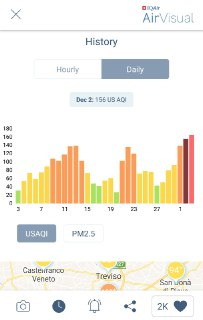

# Smartphone App Requirements

The smartphone app we were going to design must fulfill some requisites:
	1) Summarize all the information in an easy-to-use tool.
	2) Provide readable data about the behavior of a certain variable in time.
	3) Allow the most curios users to confront data between the/some stations.

Build such a thing is not an easy task, given that the space is small and so you have to optimize it, to display in the best quality possible those data that the users
expect to see. 

# Projects already implemented
The first step before even thinking about the app design was research.
We looked for similar apps and research papers/articles/anything that could be useful to our project. 
As for the mobile apps, we found some pretty inspiring examples.
We will focus on Mobile Apps, Desktop applications and ambient display that we can use and analyze.

## Mobile Apps

the first application that we are analyzinig is AirVisul, available on the Play store and Apple store.  
Air Visual is specialized in displaying informations about ari qualityusing a clean and easy-to-use interface.

We found this summary very helpful to have a quick glance on the situation of the air pollution in a certain area q

This is the main interface of AirVisual, as we can see the first thing that we notice is the summary of the air quality in a specific city.  
The specific parameters are hidden for now to give allow the user to "zoom out" on the air quality in a city.  

in our application we thought about implementig an istogram to visualize the data within a 15 window and the max value registered in those 15 days.

Swiping down we can see a more detailed view about the air quality in the selected city, showing a Daily/Hourly information about it.

Another feature of the application is to show the map of our surroundings, linking the data about the air quality to the cities near you.

 

REASONING ON THE DATASET

APP GENERAL DESING

The user can visualize the data in more detail respect to the public interface.
This is useful to confront singles variables with respect to the nearest station with a map, or to a have a quick history of variables in time.
If the smartphone reach the range of the beacon nfc proper to all station, a notification will be sent to the smartphone, advising the user of the approach to the station and if the critical variables are dangerously high or not(with respect to mean), changing the default station we want to visualize into that particular one.

INTERACTION
At the opening of the app, three things can happen
    1) The user is not in the proximity of a eco station, so a map will be visualized with the nearest ecostation(1-2 km range) and the user will choose what station visualize
    2) The user is near a station, presses the notification, the app will open up and the air condition activity of that particular  will open up
    3) The user is near a station, opens the app in the standard way and a popup will show up(You are near to "Alfa ecostation", connect to it?).

When a station is selected, the general display of that station will be visualized, that contains:
-Station name
-Time and season
-Weather around that particular station
-Type of soil and enviroment
-Height in maslm

If the user presses 

We use a lot of Icon representation for simplify the variables and how the user can immediately guess the meaning of all the data.
The charts we are going to use in the smartphone apps are:
-Histogram charts
-Gauge charts
-Map chart
-Line chart

The most important data that we thought as most important and provide some more information and history on the lecture are:
CO2 ppm
Air humidity
Wind speed 
Temperature
Rain
The histogram chart and Line chart will be visualized after having clicked on the gauge charts of a variable, another "activity" will be visualized with the istogram of the variable in a 15 day timespan and a line chart 
with the lecture of the other near station(always 1-2 km in range) and the selected one(confrontation).
To se the possible relation between different variables the technical application is suggested.

CHARTS
GAUGE CHART
The gauge chart is used to give an easy and pretty visualization to the raw data of the variables.
The max gauge will max value registered by the eco station in history for that parameter(for temperature will be the max related to the season, in order to have a more clear representation of that particular variable)

HISTOGRAM CHART
It's used to have a clear view of the behaviour of that particular variable in a certain timespan(can go from hours to days, can't say for sure what will be the most useful at the moment).
Of course data like pressure which is not subjected to clear changes and useless data like time or season will not be visualized

Line chart
It will be visualized with the Histogram chart.
This confronts the different lectures of that particular variable in the SAME exact moment but in different days(Let's say that i open the app at 2:30 PM, this will show the last lectures (which are periodic).If i wanna confront these same lectures with other stations
and have a days timespan, I have to take the lectures of the exact same lecture but done the day before).
This might get out of hand when there are four or more station near by but given the kind of data the station is checking, it's highly improbable that situation will present.

MAP CHART
This is just to select the station from which we want to visualize the data from, each station has a cursor that has as id the name of the station.

