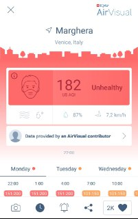
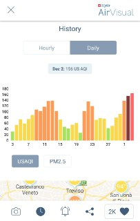
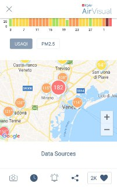

# Projects already implemented
In this part we discuss about projects that are already implemented and available.  
We will focus on Mobile Apps, Desktop applications and ambient display that we can use and analyze.

## Mobile Apps

the first application that we are analyzinig is AirVisul, available on the Play store and Apple store.  
Air Visual is specialized in displaying informations about ari qualityusing a clean and easy-to-use interface.

We found this summary very helpful to have a quick glance on the situation of the air pollution in a certain area q

This is the main interface of AirVisual, as we can see the first thing that we notice is the summary of the air quality in a specific city.  
The specific parameters are hidden for now to give allow the user to "zoom out" on the air quality in a city.  

in our application we thought about implementig an istogram to visualize the data within a 15 window and the max value registered in those 15 days.

Swiping down we can see a more detailed view about the air quality in the selected city, showing a Daily/Hourly information about it.

Another feature of the application is to show the map of our surroundings, linking the data about the air quality to the cities near you.

 

