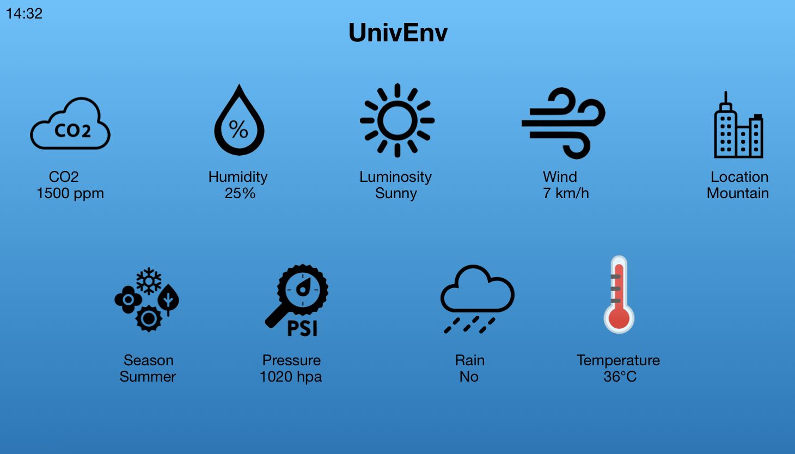

# Ambient display functioning

The ambient display is very useful to display the information of a precise place when you are near it, giving the user a quick glance about all the information he needs.

This is the home screen. It displays informations about the building where it is located in an easy, graphical way.  
The key concept of this home screen is that when a certain parameter grows over a predetermined value we will see on the interface the relative symbol. This way we will quickly know if there are some parameters that assumed strange values with respect to the mean.

This is an example of the concect explained before.
in this moment we can see that the levels of wind (km/h) and rain(mm/mq) are above the average simply watch at the home screen.
If we want additional information about every parameters registered in that location by the stations we can click the screen to proceed with the detailed view.

Here we have every symbol available in our system. They are present also in a legend aside the home screen.

## detailed view

We present here the detailed view, a screen with every parameter on it referring to our current location.

The detailed view is reachable touching the screen on the home screen.