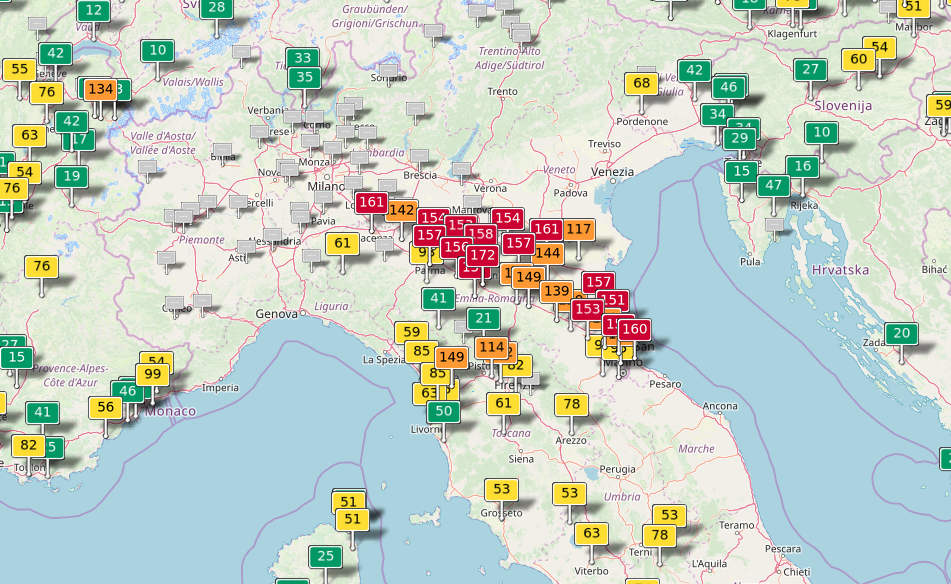
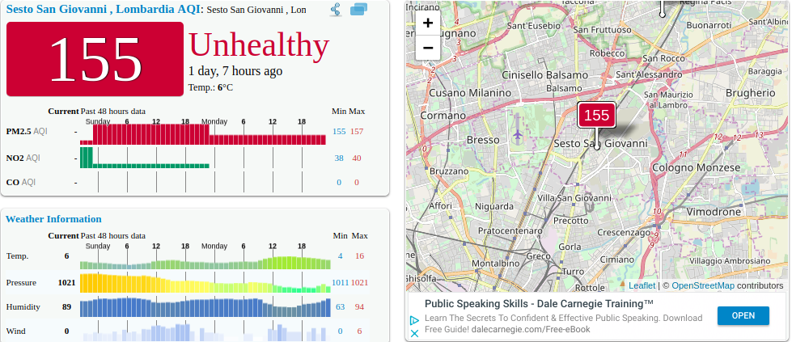

# Competitive Analysis
In this section we are going to analyze some screens from two different apps.

1. app sconosciuta
2. aqicn.org
   
## acqin.org

This site displays a large map with colored indicators that indicate the quality of the air in zone where the centers are placed.
The use of colours permits a good comparison among the various centers.

## app sconosciuta

In this second app we have more types of data representation than before.
We have a close-up on a specific location with the data relavie to it represented in various formats 
!TODO scoprire che grafici sono!

