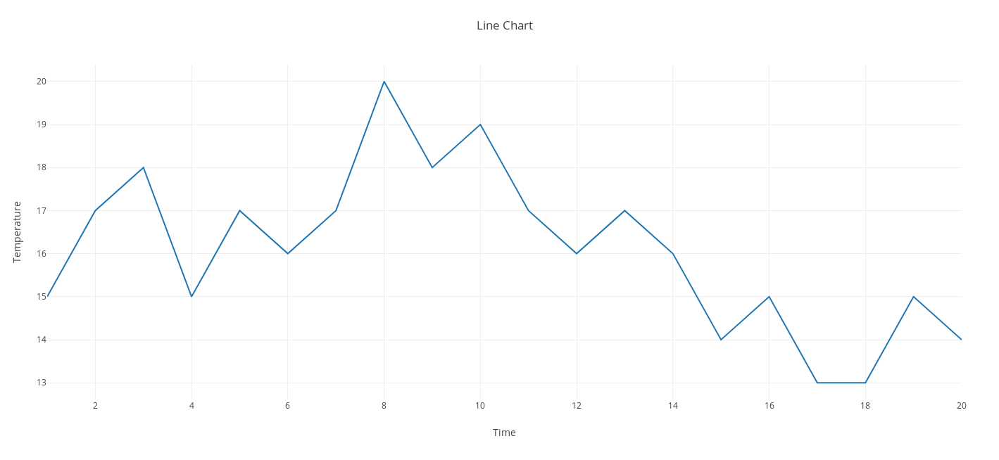
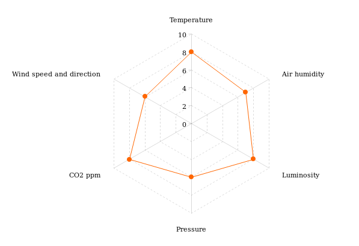
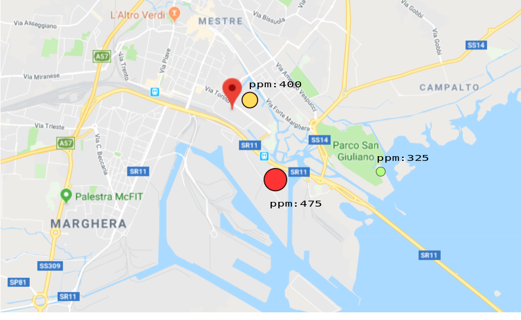
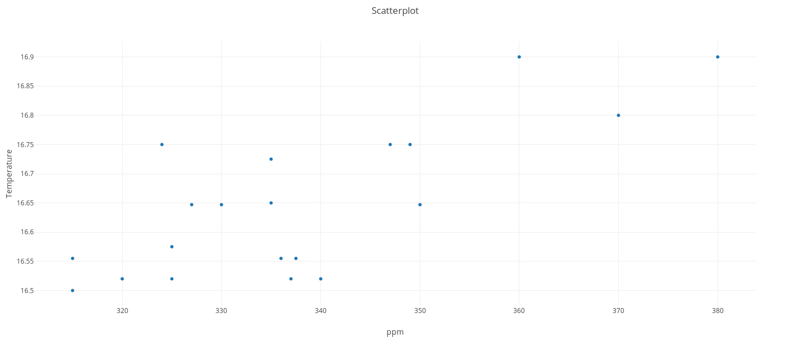

# technical interface overview
1. representation techniques utilized
2. representations contestualized in the interface
3. use cases of the technical interface

## Representation techniques
In this section we have a detailed overview about the various representation techniques and charts that are used in our technical interface.

we have this division:
- display one variable
    - Line Chart
    - violin plot

- compare multiples variables
    - Radar graph
    - Bubble map
    - Scatterplot Matrix

### Line chart

The line chart is a _chart_ which displays a series of data points called "markers" connected by straight line segments.

We use this type of representation in our technical interface to display a single data over time, allowing us to appreciate its mutations in a certain period.

### Radar graph

The radar graph is a graphic method to represent set of datas consisting of multiple variables, representing them on axis with the same origin.

This chart is used in our project to quickly check the optimality of the various parameters of a given building in the moment of the visualization.
with this tool we will be able to know which are the worst/best parameters with a glance and use this information to pick the right countermeasures.

### Bubble map

In this chart we have colored circles on a geographic map.
The color and dimension of the bubbles are in relation with the data.

in our representation the red colour of the bubbles indicates bad parameters for the station while the smaller green ones indicate positive parameters.

### Scatterplot

Scatterplot shows relation between two variables using Cartesian Coordinates.
In each axis is displayed a variable allowing us to find if between those variables there exists a relation

In our case we can see if we have a relation between the variables we choose (CO2 ppm and temperature).

  